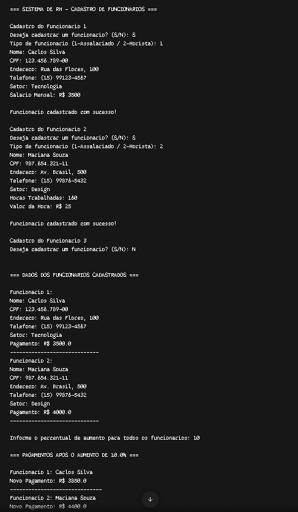

# SistemaRH - Gestão de Funcionários e Folha de Pagamento

Aplicação em linha de comando (CLI) desenvolvida em **Java** para cadastro de colaboradores, cálculo automatizado de folha de pagamento e aplicação de reajuste salarial em lote.

---

## 📌 Sobre o Projeto

O **SistemaRH** foi desenvolvido com o objetivo de simular o gerenciamento básico de recursos humanos de uma empresa, aplicando regras de negócio distintas para funcionários **Assalariados** (salário fixo) e **Horistas** (pagamento por hora trabalhada).

---

## ⚙️ Funcionalidades

- **Cadastro de Funcionários:** Registro de até 10 colaboradores (Assalariado ou Horista) informando dados pessoais, telefone e setor.
- **Cálculo de Pagamento:**
  - **Assalariado:** Retorna o salário mensal fixo.
  - **Horista:** Calcula o valor total multiplicando as horas trabalhadas pelo valor da hora.
- **Listagem Geral:** Exibição completa dos dados cadastrais e relatórios de pagamento no terminal.
- **Aumento Salarial em Lote:** Aplicação de reajuste percentual geral para todos os funcionários cadastrados de forma dinâmica.

---

## 🛠️ Conceitos de POO Aplicados

* **Abstração:** Classe abstrata `Funcionario` que serve como modelo base e define o contrato para os métodos `calcularPagamento()` e `aplicarAumento()`.
* **Herança:** As classes `Assalariado` e `Horista` estendem a classe `Funcionario`, reutilizando atributos e comportamentos comuns.
* **Polimorfismo:** Sobrescrita dos métodos abstratos (`@Override`), permitindo tratar diferentes tipos de funcionários dentro de uma mesma coleção (`ArrayList<Funcionario>`).
* **Encapsulamento:** Proteção dos atributos com modificadores de acesso `private` e uso de Getters e Setters.

---

##  Estrutura do Repositório

```text
sistema-rh/
├── src/
│   ├── Assalariado.java
│   ├── Funcionario.java
│   ├── Horista.java
│   └── Main.java
```

🚀 Como Executar
Pré-requisitos
Java Development Kit (JDK) 11 ou superior instalado.

📸 Demonstração



👤 Autor
Desenvolvido por **Eduardo Amaral**  
[GitHub Profile](https://github.com/Ravz7) | [LinkedIn](https://www.linkedin.com/in/eduardo-amaral-de-morais-2785a53a0/)
